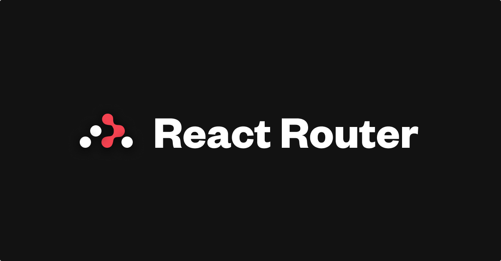

# 💻 Projeto

  

  

- Site de exibição de informações de aulas, com o objetivo de gerenciar o acesso do usuário de acordo com o seu estado de login, permitindo ou não acesso a determinadas rotas protegidas utilizando React Redux e React Router.

# ✨ Linguagens e Bibliotecas

- Javascript
- React.js
- React Redux.
- React router

# 🎮 Deploy

- Baixe o projeto
- Entre na pasta e abra o terminal
- Execute o comando `npm install`
- Execute em seguida o comando `npm run start`
- Abra o navegador na porta especificada.
